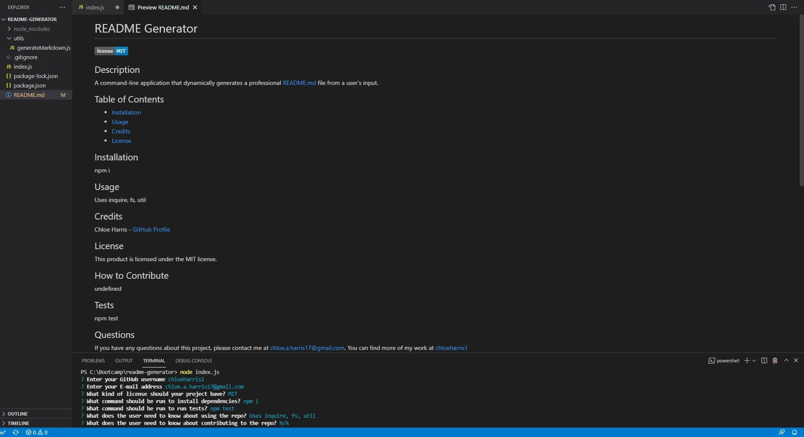

# README Generator
  
  ## Description 
  A command-line application that dynamically generates a professional README.md file from a user's input.
  ## Table of Contents
  - [Installation](#installation)
  - [Usage](#usage)
  - [Credits](#credits)
  - [License](#license)
  ## Installation 
  npm i
  #
  Installing NPM Inquirer using Terminal:
 
  ## Usage 
  Uses inquire, fs, utils
  #
  Example of Successfully Generated README from User's Input in Terminal: 
  
  ## Credits 
  Chloe Harris - [GitHub Profile](https://github.com/chloeharris1)
  ## License
  This product is licensed under the MIT license.
  ## How to Contribute 
  undefined
  ## Tests
  npm test
  ## Questions 
  If you have any questions about this project, please contact me at chloe.a.harris17@gmail.com. 
  You can find more of my work at [chloeharris1](https://github.com/chloeharris1)
  #
  Application Repository:

  ## Walkthrough Video
  https://watch.screencastify.com/v/667Hl7MCcqrJVWFGMA3a
  
